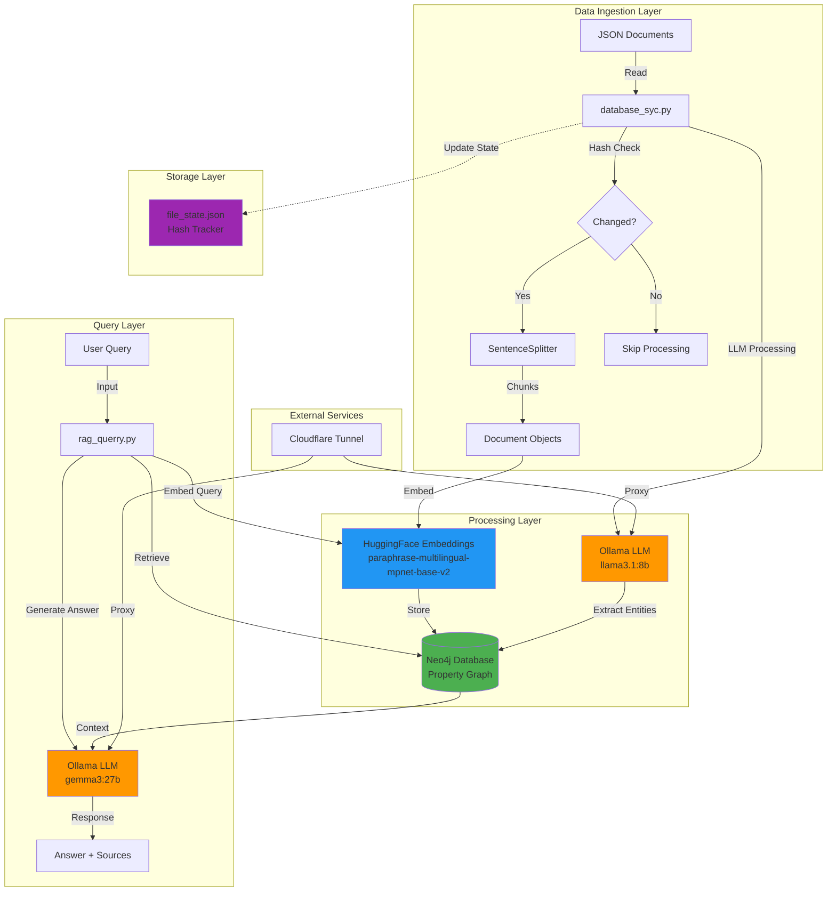
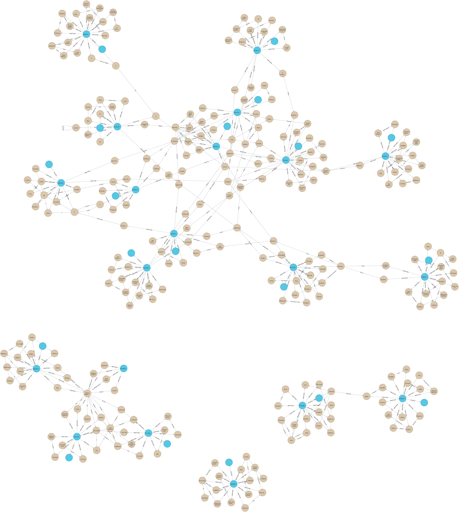

# 🧠 Graph-Based RAG System with Neo4j

A Retrieval-Augmented Generation (RAG) system using Property Graph indexing with Neo4j, LlamaIndex, and local LLM models (Ollama). This system processes JSON documents, builds a knowledge graph, and enables semantic question-answering.

## 📋 Table of Contents

- [Architecture](#architecture)
- [Features](#features)
- [Prerequisites](#prerequisites)
- [Installation](#installation)
- [Configuration](#configuration)
- [Usage](#usage)
- [Performance Metrics](#performance-metrics)
- [Known Issues & Warnings](#known-issues--warnings)
- [Project Structure](#project-structure)
- [Contributing](#contributing)
- [License](#license)

## 🏗️ Architecture



## ✨ Features

- **Incremental Updates**: Only processes new or modified documents using MD5 hash tracking
- **Property Graph Storage**: Utilizes Neo4j for rich relationship modeling
- **Hybrid Search**: Combines graph traversal with text similarity search
- **Multilingual Support**: Uses multilingual embeddings for Turkish and English content
- **Chunk-based Processing**: Handles large documents with configurable chunking
- **Error Recovery**: Continues processing even when individual chunks fail
- **Progress Tracking**: Visual progress bars using tqdm

## 📦 Prerequisites

### Software Requirements

- Python 3.8+
- Neo4j Database (Community or Enterprise Edition)
- Ollama (for local LLM inference)
- Cloudflare Tunnel (for Ollama access) or local Ollama installation

### Python Dependencies

```bash
pip install llama-index
pip install llama-index-graph-stores-neo4j
pip install llama-index-llms-ollama
pip install llama-index-embeddings-huggingface
pip install nest-asyncio
pip install tqdm
pip install sentence-transformers
```

## 🚀 Installation

1. **Clone the repository**
   ```bash
   git clone <your-repo-url>
   cd <repo-name>
   ```

2. **Install dependencies**
   ```bash
   pip install -r requirements.txt
   ```

3. **Setup Neo4j**
   ```bash
   # Using Docker
   docker run \
       --name neo4j \
       -p 7474:7474 -p 7687:7687 \
       -e NEO4J_AUTH=neo4j/your_password \
       neo4j:latest
   ```

4. **Setup Ollama**
   ```bash
   # Install Ollama
   curl https://ollama.ai/install.sh | sh
   
   # Pull required models
   ollama pull llama3.1:8b
   ollama pull gemma3:27b
   ```

## ⚙️ Configuration

### 1. Update database_syc.py

```python
CLOUDFLARE_TUNNEL_URL = "your_tunnel_url_or_http://localhost:11434"
OLLAMA_MODEL_ID = "gemma3:27b"

graph_store = Neo4jPropertyGraphStore(
    username="neo4j",
    password="your_neo4j_password",
    url="bolt://localhost:7687",
)
```

### 2. Update rag_querry.py

```python
CLOUDFLARE_TUNNEL_URL = "your_tunnel_url_or_http://localhost:11434"
OLLAMA_MODEL_ID = "gemma3:27b"

graph_store = Neo4jPropertyGraphStore(
    username="neo4j",
    password="your_neo4j_password",
    url="bolt://localhost:7687",
)
```

### 3. Prepare Data Directory

```bash
mkdir database
# Place your JSON documents in the database/ folder
```

## 💻 Usage

### Database Synchronization

Process and index documents into the Neo4j graph:

```bash
python database_syc.py
```

**What it does:**
- Scans `./database/` folder for JSON files
- Checks if files have been modified using MD5 hashing
- Chunks documents into 1024-token segments with 50-token overlap
- Extracts entities and relationships using LLM
- Stores embeddings and graph structure in Neo4j
- Tracks processing state in `file_state.json`

### Querying the System

Run queries against the knowledge graph:

```bash
python rag_querry.py
```

**Example queries** (modify in the script):
```python
get_answer("What is the relationship between Normans and Vikings?")
get_answer("Tell me about Norman religion and language.")
get_answer("Did the Normans interact with the Franks?")
```

## 📊 Performance Metrics

### Database Ingestion Performance

| File | Chunks | Processing Time | Avg Time/Chunk | Status |
|------|--------|----------------|----------------|--------|
| squad-tr-dev-v1.0.0-excluded.json | 552 | ~5:00:37 | 32.68s | ✅ Completed |
| dev-v1.1.json | 84/1388 | ~1:35:48 | 68-71s | ⚠️ Interrupted |

### Query Performance

| Query | Response Time | Result Quality |
|-------|--------------|----------------|
| "Relationship between Normans and Vikings" | 48.17s | ✅ Accurate - "Normans are descendants of Vikings" |
| "Norman religion and language" | 29.44s | ✅ Accurate - Identified Catholicism and Romance language |
| "Norman-Frankish interactions" | 33.53s | ✅ Accurate - Described synthesis of cultures |

**Average Query Response Time**: ~37 seconds

## ⚠️ Known Issues & Warnings

### 🚨 CRITICAL: Slow Processing Times

**Problem**: Database synchronization is **extremely slow** (30-70 seconds per chunk)

**Impact**:
- Processing 1000+ chunks can take **8-20+ hours**
- Large datasets are impractical with current setup
- Network disconnections during long processing sessions

**Recommended Actions**:

1. **Start Small**: Test with only **1-2 small JSON files** (< 100 chunks each)
   ```bash
   # Move large files temporarily
   mv database/large_file.json database_backup/
   ```

2. **Optimize Settings**:
   ```python
   # Reduce chunk overlap
   splitter = SentenceSplitter(chunk_size=512, chunk_overlap=20)
   
   # Use lighter LLM model
   OLLAMA_MODEL_ID = "llama3.1:8b"  # Instead of larger models
   ```

3. **Batch Processing**: Process documents one at a time manually

4. **Monitor Resources**:
   - Check Neo4j memory allocation
   - Verify Ollama isn't overloaded
   - Ensure stable network connection to Cloudflare Tunnel

### Common Errors

#### 1. `Server disconnected without sending a response`
- **Cause**: LLM request timeout or network instability
- **Solution**: Increase `request_timeout` parameter or check tunnel connection

#### 2. `Existing exports of data: object cannot be re-sized`
- **Cause**: Memory allocation issue in embedding model
- **Solution**: Restart the script, reduce batch size

#### 3. `Error: Network connection lost`
- **Cause**: Cloudflare Tunnel or Ollama connection dropped
- **Solution**: Use local Ollama instead of tunnel, or implement retry logic

## 📁 Project Structure

```
.
├── database_syc.py          # Database synchronization script
├── rag_querry.py            # Query interface script
├── database/                # JSON documents to be processed
├── file_state.json          # Processing state tracker (auto-generated)
├── graph_visualization.png  # Neo4j graph visualization
├── requirements.txt         # Python dependencies
└── README.md               # This file
```

## 🎯 Graph Visualization

The system creates a rich knowledge graph in Neo4j:



**Graph Characteristics**:
- Blue nodes: Central entities/concepts
- Beige nodes: Related facts and attributes
- Edges: Semantic relationships extracted by LLM
- Clusters: Topic-based groupings

## 🔧 Troubleshooting

### Issue: Neo4j Connection Failed
```bash
# Check if Neo4j is running
docker ps | grep neo4j

# View Neo4j logs
docker logs neo4j
```

### Issue: Ollama Model Not Found
```bash
# List available models
ollama list

# Pull missing model
ollama pull llama3.1:8b
```

### Issue: Out of Memory
- Reduce `chunk_size` in SentenceSplitter
- Limit `similarity_top_k` in query engine
- Increase Neo4j heap memory in docker run command


## 🙏 Acknowledgments

- [LlamaIndex](https://github.com/run-llama/llama_index) for the RAG framework
- [Neo4j](https://neo4j.com/) for graph database
- [Ollama](https://ollama.ai/) for local LLM inference
- [HuggingFace](https://huggingface.co/) for embedding models

---

**Note**: This is an experimental project. Performance optimization is ongoing. Use with small datasets for best results.
